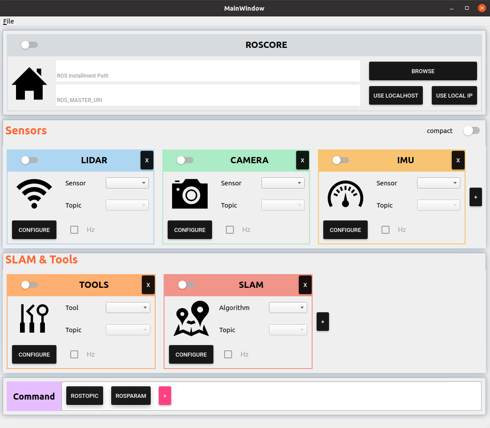

# Slam-Interface
**Slam-Interface** 是一个能够与[ROS](https://www.ros.org/)系统进行交互的UI界面，支持用户将常用的ROS系统操作（如：ROS程序的打开/关闭，ROS话题的监听，ROS服务的调用等）封装为简单的UI界面操作，方便自身，尤其是方便其他对ROS系统不了解的人使用ROS系统的相关功能。

## 1.背景
**Slam-Interface** 源于作者在实验室所做的SLAM相关项目。当时，作者常常需要在实验室的手持设备上运行一些SLAM算法，每次都需要在终端里输入若干指令来开启手持设备上IMU，LiDAR，Camera等传感器的ROS驱动程序以及SLAM程序。此外，如果要把SLAM结果传送到中央监视器上更好的显示时，通常还需要在bashrc文件中进行相应的配置以实现ROS的主从机制。这一系列操作对于作者这样的ROS高手来说自然不在话下，但当作者碰巧偷懒不去实验室，而实验室碰巧有小白同学想要玩玩SLAM设备或者向其它参观者展示我们的傲人成果时，问题就来了，我该如何让他在没有我的情况下也能顺利上手呢？无疑，我可以写一个文档（我曾经也是这样做的），文档以傻瓜式的叙述一步步地告诉他如果打开终端，输入什么指令，应当看到什么结果。但这种不优雅的解决方式始终令作者耿耿于怀，终于，作者决定以自己绵薄的码力，写一个勉强能用的UI界面来简化涉及到的操作，于是就有了如今的**Slam-Interface**。

## 2. 环境要求
### 2.1 **Ubuntu** and **ROS**
- **Ubuntu >= 16.04**
- **ROS    >= Melodic**

### 2.2. **Qt**
- **Qt    >= 5.12.8**。 Qt5的其它版本可以尝试，但不保证能够正常运行。 

## 3. 安装

## 4. 使用
整个界面如下图所示，从上到下共由四大模块组成：
- **`Roscore模块`**：配置Roscore基本设置
- **`Sensors模块`**：配置传感器ROS驱动程序
- **`SLAM&Tools模块`**：配置其它ROS程序
- **`Command模块`**：配置常用的CMD指令

    

### 4.1 基础使用

#### 4.1.1 配置Roscore
由于ROS系统的通信由Roscore进行管理，我们需要先在 **`Roscore模块`** 中对Roscore进行配置才能使得整个ROS系统正常运行。
- **配置ROS安装目录**：为使程序内部能够调用ROS的`setup.bash`，配置相应的ROS环境，需设置ROS的安装目录(作者的安装目录为`/opt/ros/noetic`)。
- **配置ROS主从机**：若需配置ROS主从机，则在主机和从机上都需设置环境变量`ROS_MASTER_URI`为主机的IP。在主机上，点击按钮`USE LOCAL IP`即可填入自身IP（对于从机则可以手动输入主机IP）。而如果不设计主从机，则可以点击按钮`USE LOCALHOST`使用本地回环地址（localhost, 即127.0.0.1）。
- **打开ROSCORE**：Roscore是ROS程序运行的基础，当配置好ROS安装目录和`ROS_MASTER_URI`变量后，便可点击`Roscore模块`的滑动按钮开启Roscore。
  

    

#### 4.1.2 配置传感器
由于作者研究方向为SLAM，不可避免地与各种传感器打交道，故把传感器单独设置为整个界面的一个 **`Sensors模块`** 。即使你不接触传感器，也建议你阅读此节，因为您同样可以把你的ROS程序“假装”当作一个特殊的传感器，并在这个模块进行设置，毕竟它们在底层都是一句`roslaunch`的事。
- **添加传感器**：点击模块里的`+`按钮来创建新的传感器，并给其取上你喜欢的名字。
- **配置传感器**：点击相应传感器的`CONFIGURE`按钮来配置启动传感器ROS驱动的launch文件。配置时，你必须提供该launch文件的命名，工作空间和具体文件目录，不可缺少其中任意一项，否则你无法从配置界面全身而退。
- **开启/关闭传感器**：若roscore已经打开，点击模块里的滑动按钮就可开启传感器。传感器开启后，再次点击模块里的滑动按钮就可关闭传感器。
- **监控传感器**：传感器开启后，可以选择特定的话题名监视其消息频率，以便判断传感器数据流是否稳定。为此，可以点击`Topic`后的下拉菜单，选择要监视的话题，并勾选`Hz`按钮。此外，若想查看程序运行中标准输出流中的内容，可以点击传感器图标右下角的红色数字进行查看。
- **删除传感器**：点击相应传感器模块右上角的`x`按钮便可删除传感器，若此时传感器正在运行，则会有相应提示窗弹出，此时你可以选择关闭传感器程序并删除。

    

#### 4.1.3 配置其它ROS程序
为了方便和整洁，界面又单独划出了一个 **`SLAM&Tools模块`** ，在这里，你可以配置你常用的其它ROS程序（我们统称为“TOOLS”）以及作者常接触的SLAM程序。本质上，它们和上一小节的传感器程序是一样的，因而相关操作请参见[4.1.2](#412-配置传感器)。

#### 4.1.4 配置常用CMD指令
有的时候，我们需要利用CMD指令与ROS系统进行交互，获取相应信息。为避免每次打开命令行终端且输入冗长指令的繁琐操作，可以在 **`Command模块`** 中，将常用的指令进行配置，使得后续执行时只需点击相应按钮即可。
- **添加指令**：点击模块里的`+`按钮来创建新的指令，新创建的指令小模块将出现在`+`按钮左侧。
- **配置指令**：**滚轮(中键)** 点击指令小模块可以重命名相应的指令。**右键**点击指令小模块来配置指令的具体内容。配置时，你必须输入相应的指令；输入结束后，你可以勾选`wait on exit`按钮来在指令最后添加`read;`语句，确保指令执行结束时命令行窗口不会立刻关闭。
- **执行指令**：若roscore已经打开，点击相应的指令小模块便可执行相应指令。
- **删除指令**：将鼠标移到相应的指令模块上，其右上方将出现红色`x`按钮，点击它即可删除相应指令。

    

#### 4.1.5 关闭界面
点击主界面右上方的`x`按钮，将会弹出第一个询问框，确认是否关闭界面，若点击yes，则会弹出第二个询问框，确认是否保留界面此时的配置，若点击yes，则将会自动保存此时的页面配置，使得下次打开时能够自动加载当前的配置。

### 4.2 进阶使用
本节介绍一些稍微花梢但也可能有用的功能。
#### 4.2.1 子模块重命名
对于`Sensors模块`和`SLAM&Tools模块`中的子模块，可以直接在其标题栏里键入你喜欢的名字。而对于`Command模块`中的子模块，正如[4.1.4](#414-配置常用cmd指令)中提到的，可以用**滚轮(中键)** 点击相应模块进行重命名。

    

#### 4.2.2 子模块移动
对于`Sensors模块`，`SLAM&Tools模块`和`Command模块`中的子模块，可用鼠标左键长按子模块并进行左右拖动来改变其位置,释放左键将其固定。

    

#### 4.2.3 修改Roslaunch的参数
ROS的[launch文件](http://wiki.ros.org/roslaunch/XML)提供了&lt;param&gt;和&lt;arg&gt;标签来设置相应的ROS参数。这就意味着在调参时，我们需要去找到相应的launch文件并进行修改,这样的操作对于作者来说是不愿面对的。为了免去麻烦，我们的界面也提供了修改参数的功能：
- **打开参数界面**：当选择好相应的launch文件(或者说ROS程序)后，**右键**点击相应的下拉菜单，即会划出参数设置界面。界面里以树状图的形式列出了该launch文件各层命名空间下对应的arg和param。
- **修改参数**：双击要修改的参数value，即可输入要设置的新值，且新值将会显示为红色（请注意：这里的修改只是运行时的修改，并不会改写原launch文件的任何内容）。如果要恢复原始值，则点击相应参数的`reset`按钮，若要恢复某命名空间下的所有参数的原始值，则点击相应命名空间的`reset`按钮。若当前launch文件中有参数被修改，则相应的项目名（'Sensor','Tool'或‘Algorithm'）将会显示为红色。

    

#### 4.2.4 紧凑布局
如果你是在小屏幕下使用该界面，或者你不喜欢作者设计的丑陋布局，那作者也提供了另一个选项——紧凑布局。触发它的开关就藏在**`Sensors模块`**右上方`compact`按钮，轻轻点击一下，界面就啪地一下变紧凑了，再点击一下就又恢复如初了。

    

## 5. 致谢
在界面的设计实现中，我们大量用到了[qt-material-widgets](https://github.com/laserpants/qt-material-widgets)，这里由衷地致以感谢！