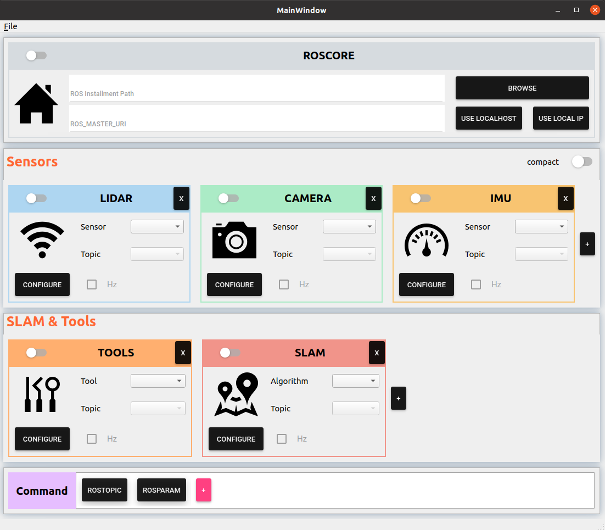

# Slam-Interface

<div align="center">
    
    
</div>

\[ [简体中文](README.md) | [English](README_en.md) \]

**Slam-Interface** is a UI interface that can interact with the [ROS](https://www.ros.org/) system, supporting users to encapsulate common ROS system operations (such as: ROS program opening/closing, ROS topic monitoring, ROS service calling, etc.) into simple UI interface operations. It is convenient for both ROS users and those who do not know about ROS systems to use the relevant functions of ROS systems.

# Table of Contents
1. [Background](#1background)
2. [Environment](#2-environment)
3. [Installation](#3-installation)
4. [Usage](#4-usage)
5. [Acknowledgement](#5-致谢)

## 1.Background
**Slam-Interface** is derived from SLAM-related projects the author did in the lab. At that time, the author often needed to run some SLAM algorithms on the handheld device in the lab, and each time I needed to enter several lengthy instructions in the terminal to open ROS drivers and SLAM programs for IMU, LiDAR, camera and other sensors on the handheld device. In addition, if SLAM results are to be transmitted to a central monitor for better display, it is usually necessary to configure the corresponding configuration in the `bashrc` file to implement the master-slave mechanism of ROS. This series of operations is naturally not a problem for ROS masters like the author, but when the author happens to be lazy and is not present at the lab, and the novice in the lab wants to play with SLAM equipment or show our proud results to other visitors, the question arises, how can he done everything alone? Undoubtedly, I could write a document (and I used to do so) that tells him step-by-step in a point-and-shoot narrative what instructions to enter and what to see after certain step. But this inelegant solution has always bothered the author, and finally, the author decided to use his own modest code power to write a barely usable UI interface to simplify the operations involved, so there is current **Slam-Interface**.

## 2. Environment
### 2.1 **Ubuntu** and **ROS**
- **Ubuntu >= 16.04**
- **ROS    >= Melodic**

### 2.2. **Qt**
- **Qt    >= 5.12.8**. Other versions of Qt5 are not sure to work.

## 3. Installation
- **Download**：downloam the proper version from the [page](https://github.com/Tompson11/SLAM_interface/releases).
- **Decompression**：decompress the bag.
- **Installation**：open a terminal window at the bag directory and run the installation script：
```bash
sudo bash setup.sh
```

## 4. Usage
Find the icon of the `SlamInterface` at the system menu and click it to open the interface：

<div align="center">
    
</div>

The whole interface can refer to the following figure, and it consists of 4 modules from top to bottom：
- **`Roscore Module`**：Configure the ROSCORE.
- **`Sensors Module`**：Configure the ROS programs for sensors.
- **`SLAM&Tools Module`**：Configure other useful ROS programs
- **`Command Module`**：Configure the common ternimal instructions for ROS. 

<div align="center">
    
</div>

### 4.1 Basic Usage

#### 4.1.1 Configure the Roscore
Since the communication of the ROS system is managed by Roscore, we need to configure Roscore in the 'Roscore module' to entire the ROS system can function properly.
- **Configure ROS installation directory**: In order to enable the program to call ROS 'setup.bash' and configure the corresponding ROS environment, you need to declare the installation directory for ROS (e.g. the author's installation directory is `/opt/ros/noetic`).
- **Configure ROS master-slave**: If you want to use ROS master-slave machinism, you need to set the environment variable `ROS_MASTER_URI` to the IP address of the master on both the master and slave machine. On the master, click the button `USE LOCAL IP` to fill in its own IP address (For the slave, you can manually enter the IP address of the master). If you do not need a master-slave, you can click the button `USE LOCALHOST` to use the local loopback address (127.0.0.1).
- **Open Roscore**: Roscore is the basis for runing ROS programs. When the ROS installation directory and the `ROS_MASTER_URI` variable are configured, you can click the sliding button of the `Roscore Module` to open Roscore. Corresponding message box will pop up no matter success or failure.

<div align="center">
    
</div>

#### 4.1.2 Configure the sensors
Since the author's research field is SLAM, it is inevitable to deal with various sensors, so the **Sensors module** is set as a seperate module of the entire interface. Even if you don't deal with the sensors, it is recommended that you read this section, because you can also "pretend" your ROS program as a special sensor and set it up in this module, after all, they are all executed by "roslaunch" command at the bottom.
- **Add a Sensor**: Click the `+` button in the module to create a new sensor and give it a name you like.
- **Configure the Sensor**: Click the `CONFIGURE` button for the corresponding sensor to configure the launch file that boots the ROS driver for the sensor. When configuring, you must provide the name of the launch file, the corresponding workspace and the specific file directory, any of which are indispensable, otherwise you cannot exit from the configuration interface.
- **Turn the Sensor on/off**: If roscore is already open, click the slide button in the module to turn on the sensor. Once the sensor is turned on, tap the slide button in the module again to turn off the sensor.
- **Monitor the Sensor**: After the sensor is turned on, you can select a specific topic name to monitor its message frequency in order to determine whether the sensor data flow is stable. To do this, click on the drop-down menu after 'Topic', select the topic you want to monitor, and tick the 'Hz' button. In addition, if you want to see the contents of the standard output stream from the running program, you can click on the red number in the lower right corner of the correspoinding sensor icon.
- **Delete the sensor**: Click the `x` button in the upper right corner of the corresponding sensor module to delete the sensor, if the sensor is running, a corresponding prompt window will pop up, at which point you can choose to close the sensor program and delete.


<div align="center">
    
</div>

#### 4.1.3 Configure other ROS programs
For convenience and cleanliness, the interface has a separate **`SLAM&Tools Module`**, where you can configure other ROS programs (collectively referred to as "TOOLS") as well as SLAM programs as the author. Essentially, they are the same as the sensor program in the previous section, so just refer to [4.1.2](#412-configure-the-sensors).

#### 4.1.4 Configure the ROS command
Sometimes, we need to use terminal commands to interact with the ROS system and obtain the corresponding information. In order to avoid the tedious operation of opening the command line terminal and entering lengthy instructions every time, you can configure the commonly used instructions in the **'Command module'**, so that you only need to click the corresponding button when subsequent execution.
- **Add Command**: Click the `+` button in the module to create a new command widget, and the newly created widget will appear to the left of the `+` button.
- **Configuration Command**: Click the corresponding command widget with the **scroll wheel (middle button)** to rename the corresponding command. **Right-click** on the command widget to configure the specific content of the command. When configuring, you must enter the appropriate instructions; After typing, you can tick the `wait on exit` button to add `read;` at the end of the command to ensure that the ternimal window will not exit on finish.
- **Execute Command**: If roscore is already open, click on the corresponding command widget to execute the corresponding command.
- **Delete Command**: Move the mouse over the corresponding command widget, a red `x` button will appear at the top right, click on it to delete the corresponding command.

<div align="center">
    
</div>

#### 4.1.5 Close the interface
Click the `x` button at the top right of the main interface, the first inquiry box will pop up to confirm whether to close the interface, if you click yes, the second inquiry box will pop up to confirm whether to save the current configuration of the interface, if you click yes, the current configuration will be automatically saved, so that it can be automatically loaded when you open it next time.

### 4.2 Advanced Usage
This section describes some features that are slightly more fancy but may also be useful.

#### 4.2.1 Rename the submodule
For submodules in the `Sensors module` and `SLAM & Tools module`, you can type your preferred name directly into the title bar. For submodules in the `Command module`, as mentioned in [4.1.4](#414-configure-the-ros-command), you can click on the corresponding module to rename it with the scroll wheel (middle button).

<div align="center">
    
</div>

#### 4.2.2 Move the submodule
For submodules in the `Sensors Module`, `SLAM & Tools Module` and `Command Module`, you can change its position by draging with the left button, and release the left button to fix it.

<div align="center">
    
</div>

#### 4.2.3 Modify the parameters of roslaunch
[launch file](http://wiki.ros.org/roslaunch/XML) in the ROS provides &lt;param&gt; and &lt;arg&gt; tags to set the corresponding ROS parameters. This means that when adjusting parameters, we need to find the corresponding launch file and modify it, which however is unacceptable for the author. To avoid trouble, our interface also provides the ability to modify parameters:
- **Open parameter interface**: When the corresponding launch file (or ROS program) is selected, **right-click** the corresponding drop-down menu, and the parameter setting interface will be drawn up. The interface lists the corresponding `arg` and `param` under all the namespace in the launch file in the form of a tree view.
- **Modify parameters**: Double-click the parameter value you want to modify to enter the new value, and the new value will be displayed in red (please note: the changes here are only runtime changes, and will not overwrite any content of the original launch file). If you want to restore the original value, click the `reset` button for the corresponding parameter. And to restore the original value of all parameters under a namespace, click the `reset` button for the corresponding namespace. If a parameter is modified in the current launch file, the corresponding item name ('Sensor', 'Tool' or 'Algorithm') will be displayed in red.

<div align="center">
    
</div>

#### 4.2.4 Compact Layout
If you're using the interface on a small screen, or you don't like the ugly layout designed by the author, the author also offers another option – compact layout. The switch that triggers it is hidden in the `compact` button at the top right of the **Sensors Module**, and with a light click, the interface layout will become compact.

<div align="center">
    
</div>

## 5. Acknowledgement
In the design and implementation of the interface, I have used lots of widgets in [qt-material-widgets](https://github.com/laserpants/qt-material-widgets). I'd like to express my sincere appreciation here!
